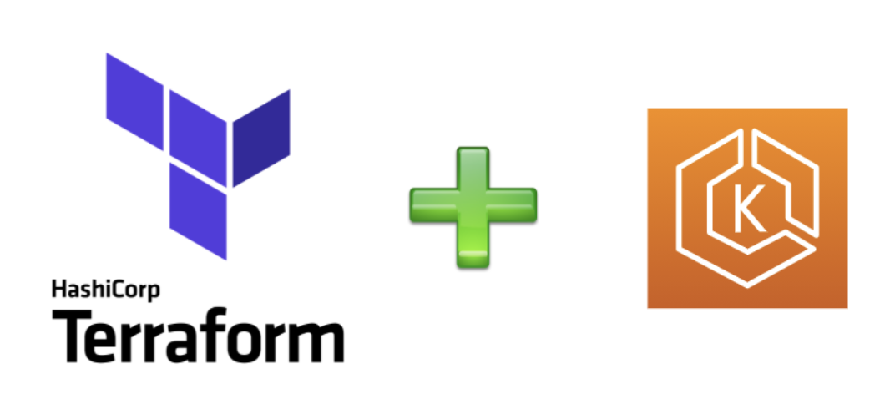

<h1 align="center">Kubernetes - EKS</h1>

  
  

  <a href="#-projeto">Projeto</a>&nbsp;&nbsp;&nbsp;|&nbsp;&nbsp;&nbsp;
  <a href="#-tecnologias">Tecnologias</a>&nbsp;&nbsp;&nbsp;|&nbsp;&nbsp;&nbsp;
  <a href="#-roadmap">Roadmap</a>&nbsp;&nbsp;&nbsp;|&nbsp;&nbsp;&nbsp;
  <a href="#-referências">Referências</a>

  

## 💡 Projeto

Provisionar uma infraestrutura na AWS: VPC, EKS, OICD etc
Utilizar IAC

## ✨ Tecnologias

- AWS
- Kubernetes
- Terraform

## 👣 Roadmap

- [x] [Instalar pré-requisitos para o projeto ]
  - [x] [Instalação do AWS CLI](https://docs.aws.amazon.com/cli/latest/userguide/getting-started-install.html)
  - [x] [Instalação do Terraform](https://developer.hashicorp.com/terraform/tutorials/aws-get-started/install-cli)
  - [x] [Instalação do Kubectl](https://kubernetes.io/docs/tasks/tools/)
  - [x] [Instalação do Docker](https://docs.docker.com/engine/install/)
  - [x] [Instalação do Ansible](https://docs.ansible.com/ansible/latest/installation_guide/intro_installation.html)
  - [x] [Instalação do Helm](https://helm.sh/docs/intro/install/)
  - [x] [Instalação do eksctl](https://docs.aws.amazon.com/emr/latest/EMR-on-EKS-DevelopmentGuide/setting-up-eksctl.html)
- [x] [Preparar um Setup network na aws com o Terraform]
  - [x] Definição de faixas de ip a serem utilizadas
  - [x] [1 Vpc](https://registry.terraform.io/providers/hashicorp/aws/latest/docs/data-sources/vpc)
  - [x] 2 Subnets Públicas
  - [x] 2 Subnets Privadas
  - [x] 1 Internt Gateway
  - [x] 1 Nat Gateway
  - [x] [2 Route Table](https://registry.terraform.io/providers/hashicorp/aws/latest/docs/resources/route_table)
  - [x] [1 Route Table associada a Subnet Pública e 1 Route Table associada a Subnet Privada](https://registry.terraform.io/providers/hashicorp/aws/latest/docs/resources/route_table_association)
- [x] Subir Cluster Kubernetes
  - [x] [EKS](https://registry.terraform.io/providers/hashicorp/aws/latest/docs/resources/eks_cluster)
  - [x] [Node Groups](https://registry.terraform.io/providers/hashicorp/aws/latest/docs/resources/eks_node_group)
  - [ ] [Permissionamento ao Cluster e Node Groups - Example IAM Role for EKS Node Group](https://registry.terraform.io/providers/hashicorp/aws/latest/docs/resources/eks_node_group)
- [ ] [ECR](https://registry.terraform.io/providers/hashicorp/aws/latest/docs/resources/eks_cluster)
- [ ] [Playbook Ansible para Instalar AWS Load Balancer](https://docs.aws.amazon.com/eks/latest/userguide/lbc-helm.html)

## 📄 Referências

- [Documentação AWS resources Terraform](https://registry.terraform.io/providers/hashicorp/aws/latest/docs)
- [Ansible - Best Practices](https://docs.ansible.com/ansible/2.8/user_guide/playbooks_best_practices.html#best-practices)
- [Instalação so AWS Load Balancer Controller usando Helm ](https://docs.aws.amazon.com/eks/latest/userguide/lbc-helm.html)
- [Enabling IAM Roles for Service Accounts](https://registry.terraform.io/providers/hashicorp/aws/latest/docs/resources/eks_cluster) 
- [Ansible - Run Your First Command and Playbook](https://docs.ansible.com/ansible/latest/network/getting_started/first_playbook.html)
- [Install the AWS Load Balancer Controller using Helm](https://docs.aws.amazon.com/eks/latest/userguide/lbc-helm.html)