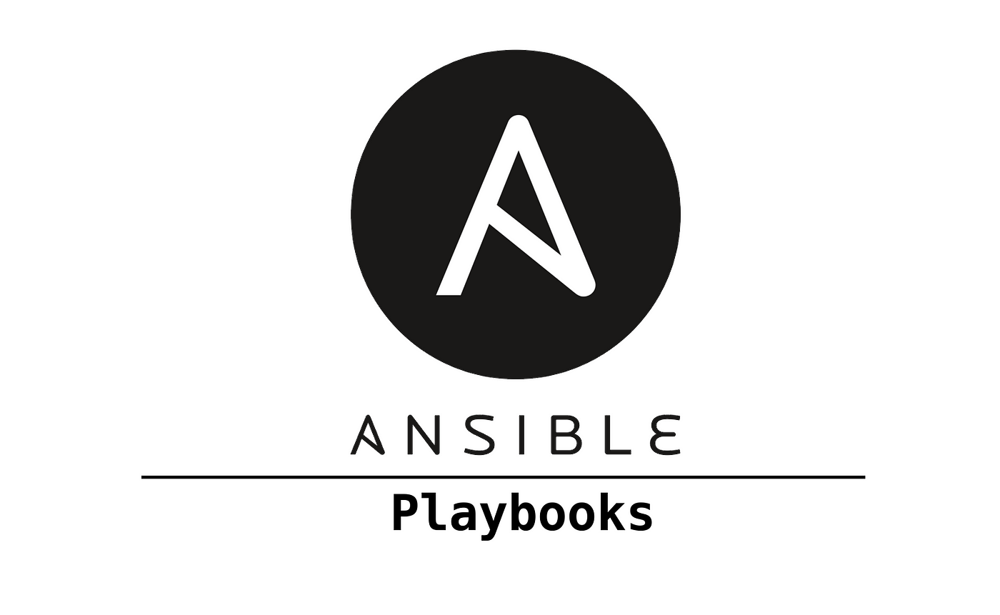

<h1 align="center">Ansible Playbook</h1>
<p align="center">
  
</p>

## Inventory

O inventário está separado por:

- `eks_cluster.yaml` [ Ambiente AWS]
- `kubeadm.yaml` [Setup Kubernetes com Kubeadm]
- `kubespray.yaml` [ Setup Kubernetes com Kubespray]

Ao rodar o playbook posso apontar para o `inventory` que eu quiser a aplicar a configuração.

## Playbook

- O Playbook principal é o `site.yaml` 
- Através do `site.yaml` consigo fazer chamadas apontando para determinadas `roles` e definir tags para cada role, facilitando assim o seu apontamento. 

Exemplo: ansible-playbook -i inventory/kubeadm.yaml site.yaml --tags requirements

## Roles

- Role 1: `requirements_configure` -> Role responsavel por instalar alguns pacotes necessários

- Role 2: `kubeconfig_configure` -> Role responsável pela configuração do kubeconfig 

- Role 3: `helm_configure` -> Role responsável pela instalação e configuração do helm

- Role 4: `argocd_configure` -> Role responsável pela instalação e configuração do argocd

- Role 5: `haproxy_configure` -> Role responsável pela instalação e configuração do Haproxy Ingress Controller

- Role 6: `alb_configure` -> Role responsável por instalar e configurar o Application Load Balancer

## Tags

- requirements_configure: `requirements`
- kubeconfig_configure: `kubeconfig`
- helm_configure: `helm`
- argocd_configure: `argo`
- haproxy_configure: `haproxy`
- alb_configure: `alb`

## Command
```bash
ansible-playbook -i inventory/kubeadm.yaml site.yaml --tags requirements,kubeconfig,helm,argo,haproxy
```