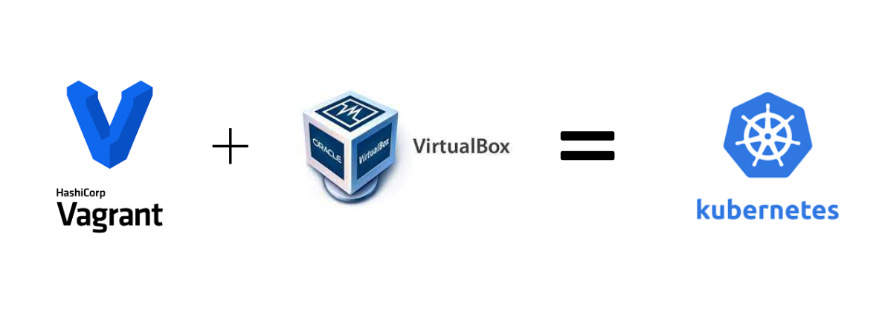

<h1 align="center">Kubernetes - Setup Local para teste</h1>

- Criação de um Setup Kubernetes Local para realização e validação de itens evitando ter que realizar essas validações diretamente no eks aumentando o tempo de consumo na aws. 

  

## Setups locais

- Setup 1: `Kubespray`
- Setup 2: `Vagrant Kubeadm`

## Balanceador para gerenciamento do cluster

- Haproxy